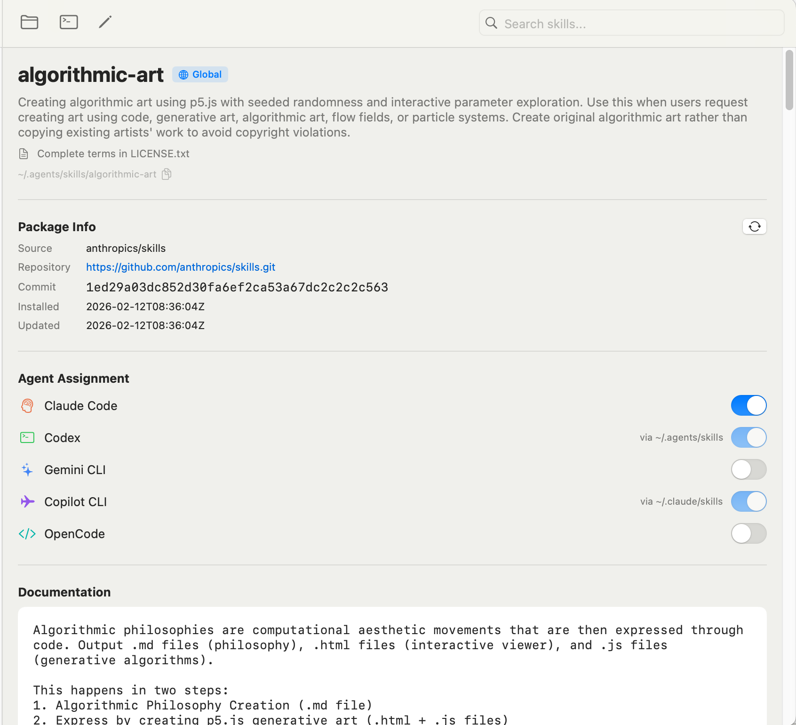

# SkillsMaster

SkillsMaster 是一个面向 macOS 的原生应用，用统一的图形界面管理多种 AI 编程代理的 Skills。它聚焦于 **扫描、展示、安装、编辑、更新、同步**，把本地目录、symbolic link、lock file 与 Repository 来源整合成一套可维护的工作流。

## 它解决什么问题
如果你同时使用多个 AI 编程代理，通常会遇到这些问题：
- Skills 分散在不同目录，难以统一查看
- `SKILL.md` 需要手动编辑，容易出错
- symbolic link、lock file、仓库来源难以追踪
- 想检查更新或切换 Agent 安装状态时，缺少统一入口

SkillsMaster 的目标，就是把这些分散的本地操作整合到一个清晰的 macOS UI 里完成。

## 核心能力
- 统一扫描本地 Skills，并按 Agent、作用域、安装状态集中展示
- 解析并编辑 `SKILL.md`，支持 YAML frontmatter + Markdown 正文
- 从 GitHub、Registry 与 Custom Repository 安装 Skills
- 管理 Agent 分配、symbolic link、lock file 与更新检查
- 监听文件系统变化，在 UI 中自动刷新
- 支持主题切换、应用版本检查与 Release 打包链路

## 适用人群
- 同时使用 Claude Code、Codex、Gemini CLI、GitHub Copilot、Cursor、OpenCode 等多个 Agent 的开发者
- 希望通过 GUI 管理本地 Skills，而不是频繁手改目录和配置文件的用户
- 需要追踪 Skill 来源、更新状态与安装归属的维护者

## 环境要求
- macOS 14+
- Xcode 15+
- Swift 5.9+

## 快速开始
### 从源码运行
```bash
git clone <your-repo-url>
cd SkillsMaster
./run
```

### 运行测试
```bash
swift test
```

### 打包应用
```bash
./scripts/package-app.sh --version 1.2.3 --zip
```

## 仓库结构
- `Sources/SkillsMaster/`：应用源码
- `Tests/SkillsMasterTests/`：单元测试
- `scripts/`：运行、打包、Release 相关脚本
- `docs/`：架构、开发、发布与能力边界文档
- `.github/workflows/`：CI / Release workflow

## 文档分工
- `README.md`：回答“这是什么、适合谁、如何快速开始”
- `docs/Index.md`：回答“详细文档在哪里、应该先读哪篇、改动后该更新哪篇”
- `AGENTS.md`：回答“协作时按什么原则执行、哪些改动要先确认、如何验证与汇报”

如果你准备参与开发，先读 `docs/Index.md`；如果你准备在仓库里执行修改，再读 `AGENTS.md`。

## 界面预览

